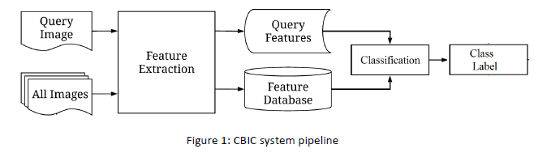

# Content-Based-Image-Classification

In this project, Content Based Image Classification (CBIC) System based on different types of histogram features is implemented. Different quantization levels are used for both grayscale intensity and color histograms. In addition, different levels of grids are applied during feature extraction. Finally, classification is done with K-Nearest Neighbour.
The main purpose of the CBIC systems is to classify a query (test) image into one of the categories given in a large database. The classification should be done by comparing semantic contents of the images in the database and the query. However, as we all know, images are represented as a collection of numbers (i.e. pixels) in the lowest level. Hence, there is a difficulty in matching images, which is called the “semantic gap”. In order to overcome this difficulty, images should be described as semantically meaningful feature vectors which are (semantically) higher level representations than collection of numbers. You are going to implement some of these higher level representations in scope of this project, but let us first take a glance of the general structure of the CBIC system. The CBIC system pipeline starts with feature extraction of the query image and all other images in the database as seen in the Figure 1. After obtaining all the features, a similarity test is applied between the features of each image in the database and the query image. Finally, based on the result of classification, the most similar images are identified and assigned to appropriate class label.

    

## HISTOGRAM BASED FEATURE EXTRACTION

In this section, features extracted for the image itself and classification is done for different number of neighbors and different quantization levels.

#### Grayscale Histogram

|      | q=1  | q=128 | q=256 |
| ---- | ---- | ----- | ----- |
| K=1  | 8    | 33    | 36.2  |
| K=5  | 7.6  | 34.28 | 39    |
| K=10 | 8    | 29.5  | 35.2  |

#### RGB Histogram

|      | q=1  | q=32  | q=64  | q=100 |
| ---- | ---- | ----- | ----- | ----- |
| K=1  | 8    | 25.71 | 33.33 | 33.33 |
| K=5  | 7.6  | 26.6  | 37.14 | 37.14 |
| K=10 | 8    | 27.61 | 23.8  | 35.23 |

## GRID BASED FEATURE EXTRACTION

In this section, images are divided into a grid and histograms are extracted for each cell of the grid individually. Then, histograms are concatenate and feature vectors are created. 2x2 (level 2) and 4x4 (level 3) grids are used for grid based feature extraction, and classification is done for different number of K values and different quantization levels.

### Level 2

#### Grayscale Histogram

|      | q=1  | q=128 | q=256 |
| ---- | ---- | ----- | ----- |
| K=1  | 7.6  | 35.23 | 46.7  |
| K=5  | 7.6  | 35.23 | 44    |
| K=10 | 8    | 33.3  | 38    |

#### RGB Histogram

|      | q=1  | q=32  | q=64  | q=100 |
| ---- | ---- | ----- | ----- | ----- |
| K=1  | 7.6  | 37.13 | 31.42 | 36.19 |
| K=5  | 7.6  | 35.23 | 25    | 33.3  |
| K=10 | 7.6  | 24    | 28.6  | 30.6  |

### Level 3

#### Grayscale Histogram

|      | q=1  | q=128 | q=256 |
| ---- | ---- | ----- | ----- |
| K=1  | 7.6  | 39    | 44.8  |
| K=5  | 7.6  | 33.3  | 34.3  |
| K=10 | 7.6  | 26    | 31.4  |

#### RGB Histogram

|      | q=1  | q=32 | q=64 | q=100 |
| ---- | ---- | ---- | ---- | ----- |
| K=1  | 7.6  | 39   | 54.3 | 38.1  |
| K=5  | 7.6  | 36.1 | 46.7 | 34.3  |
| K=10 | 7.6  | 30   | 40   | 27    |

### 
